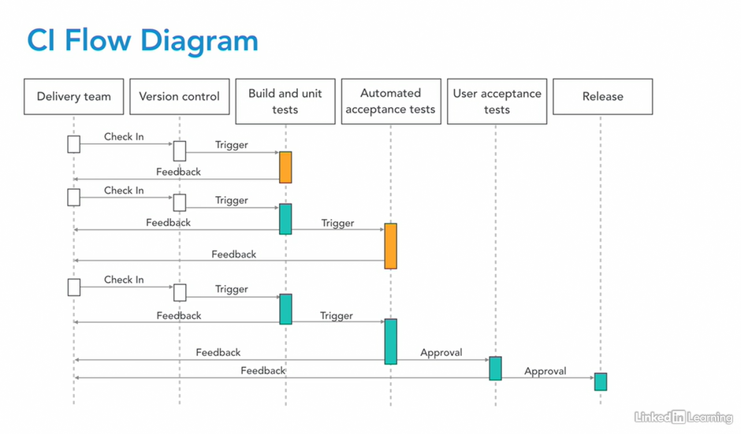

# DevOps-CI-CD

## Pipeline in practice

### Source Code -> Version Control (Source repository)
* Git
* Perforce
* Subversion

### Build System (watch your repository and triggers whatever build is required when it changes)
* Jenkins
* bamboo
* TeamCity
* CircleCI (online service) 
* Travis CI (online service)
* Even build scripts you cobbled together that run Make can qualify, but these lack the webhooks, off, plugins, and other features that'll help you optimize the process. Its job is to build code and run unit tests, and, of course, to provide feedback and visibility into the build process
* Depending on what language you're using, you may have a variety of compilation and build orchestration tools. 
    - If it's a compiled language you may need a <b>C</b> or <b>Go</b> compiler. Interpreted languages may not have a compilation step and skip straight to packaging.
* You might have a build definition file, like a <b>Make file</b> or a <b>Docker file</b>, or perhaps you use something like <b>Maven</b>, <b>Ant</b>, or <b>Gradle</b> as a command-line build orchestration tool.
* This allows developers to build on their local machine and to keep as much code in source control and out of the build console configuration as possible. 

### Unit tests
* You probably have a unit test harness, which may be a separate tool, but is invoked inside the build system. Unit tests are basic tests designed to verify a piece of code is doing the job it was intended to do. Unit tests don't have dependencies on external systems. At most they mock or stub out anything outside their own code base. They're your first line of defense in figuring out whether your build is going to work as expected.

### Artifacts
* What is built is packaged into an <b>artifact</b>
* Part of this is usually language dependent. For example, Java code is usually put into JAR files and then those are combined up into a WAR or EAR file, but you may have a higher level packaging structure you prefer, like an RPM package or Docker image.

### Artifact Repository
* Once you've packaged the code, it goes into your artifact repository.
* Some people just use a <b>storage device or Amazon S3 for their artifacts</b>
* Others use tools built for the job like <b>Nexus</b> or <b>Artifactory</b>, or there's technology-specific repos like <b>Docker Registries</b> or <b>Puppet Forges</b>.

### Deployment Server

### Deployment Tools
* You need a deployment tool to bring up a working instance of your service. 
* You'll use the same tool to deploy both to your test and production environments. 
* Your deployment code is code, and, like any other code, you want to find any issues in the build and test cycle, not when you're deploying to production.

### CI environment
* So you run your deployment tool on a test environment, sometimes also called the CI environment, to get your service up and running. 

### Integration testing
* Next, you perform integration testing, which is designed to exercise a real running service in a real environment and ensure that it's working correctly. 

### Acceptance testing (E2E Tests)
* Then you have an end-to-end acceptance testing stage. 
* This may include a manual testing component. Manual tests can be mostly dispensed with once you reach CD process maturity, but will almost always predominate initially. 

### Production environment
* Then you use the same artifact that passed testing and the same deployment tool to deploy it to the production environment. 
* Ideally, you use some of the exact same acceptance tests to test it there as well. 

### NOTES 
* There are many more types of tools you can layer onto your pipeline, test coverage measurement tools, Linters, security testing tools, performance testing tools, but these are the basics, and nailing the basics is the key to getting to continuous integration, and then, if you want, to continuous deployment.

### CI FLOW Diagram

